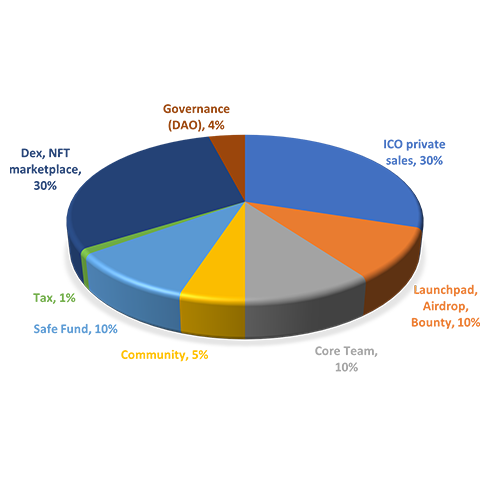

# Tokenization

#### MGC- World’s First-Ever 99% Public Owned DAO Based Coin

 

The main currency is the MGC tokens of the Meta Gold Coin Project. With tokens, you can experience a VR land where you can use your resources to build new things. You can buy them all at the same time or create your own. We use the native token MGC to provide an open world of shopping and entertainment.

$MGC info

Name : Meta Gold Coin

Symbol : MGC

Type : BEP20 (BSC)

Contract : [**0x47140cF05Ef50be2A81772eE264d040277D937ce**](https://bscscan.com/token/0x47140cF05Ef50be2A81772eE264d040277D937ce)****

****

### Distribution

